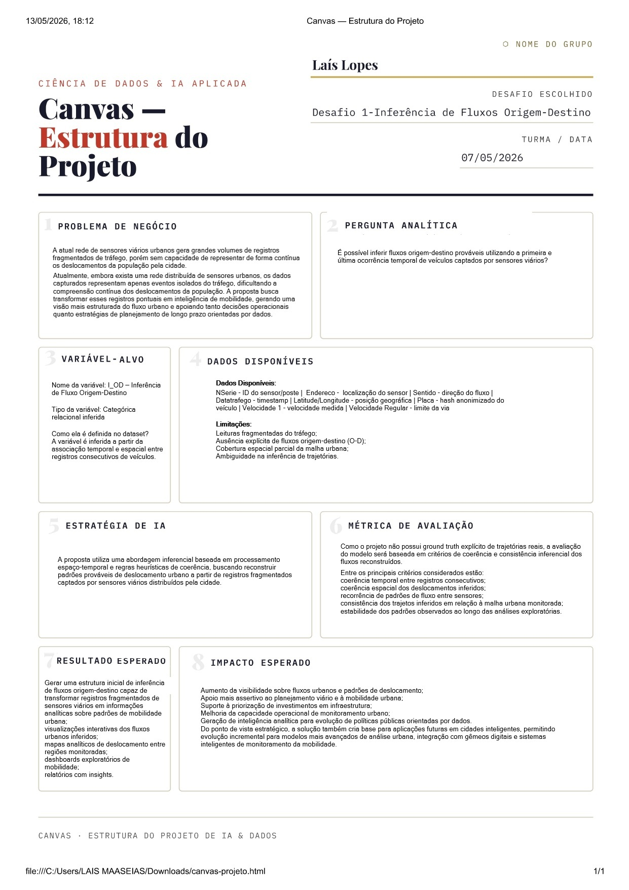
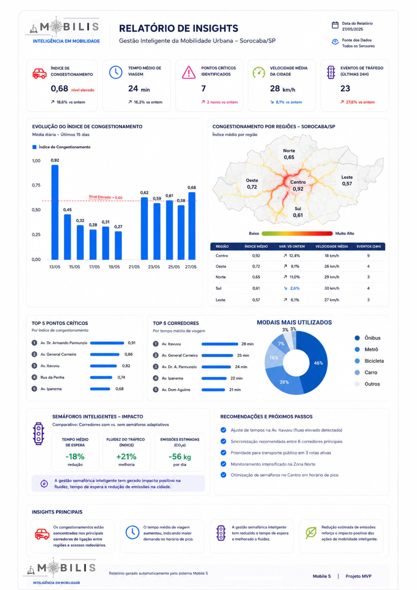
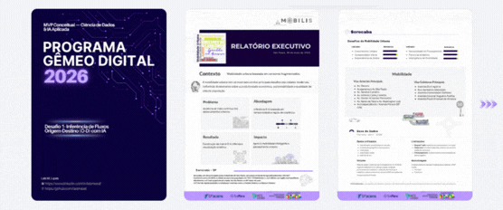

# 🚦 Mobilis — Inferência de Fluxos para Mobilidade Urbana Inteligente

# Sumário

- [Sobre o Projeto](#sobre-o-projeto)
- [Cenário](#cenário)
- [Objetivo](#objetivo)
- [Abordagem Analítica](#abordagem-analítica)
- [Canvas do Projeto](#canvas-do-projeto)
- [Regras Temporais de Coerência](#regras-temporais-de-coerência)
- [Análise Exploratória](#análise-exploratória)
- [MVP - Dashboard Conceitual](#mvp---dashboard-conceitual)
- [Relatório Executivo](#relatório-executivo)
- [Limitações Identificadas](#limitações-identificadas)
- [Possíveis Evoluções Futuras](#possíveis-evoluções-futuras)

## Sobre o Projeto

Projeto de inferência de fluxos urbanos utilizando análise espaço-temporal e dados de sensores para mobilidade urbana inteligente.

O **Mobilis** é um projeto desenvolvido no contexto do programa **Gêmeo Digital**, com foco na inferência de fluxos urbanos a partir de dados coletados por sensores distribuídos na cidade de Sorocaba-SP.

A proposta busca transformar dados fragmentados em informações relevantes para apoiar análises de mobilidade urbana, conectividade entre regiões e futuras tomadas de decisão relacionadas a cidades inteligentes.

---

# Cenário

Sorocaba é um dos principais polos industriais do estado de São Paulo, possuindo aproximadamente:

-  **450 km²** de extensão territorial
-  **762 mil habitantes**
-  **50 sensores urbanos** distribuídos estrategicamente pela cidade com operação contínua

Os sensores realizam leituras de placas veiculares em diferentes pontos da malha urbana. Entretanto, os dados disponíveis não apresentam explicitamente a origem e destino dos deslocamentos, exigindo técnicas de inferência para estimar os fluxos O-D (Origem-Destino).

---

# Objetivo

Desenvolver uma abordagem inicial para inferência de fluxos urbanos utilizando dados espaço-temporais provenientes de sensores urbanos, permitindo:

- Identificar padrões de deslocamento
- Estimar conexões entre regiões
- Apoiar análises exploratórias de mobilidade urbana
- Consolidar visualizações para suporte à tomada de decisão

---

# Abordagem Analítica

Após a exploração e compreensão da base de dados, optou-se por uma estratégia de **inferência espaço-temporal dos fluxos**, considerando:

- a **primeira leitura cronológica** como possível origem
- a **última leitura** como possível destino

Essa abordagem foi escolhida por apresentar:

- menor complexidade computacional
- maior interpretabilidade e explicabilidade
- viabilidade dentro das limitações do projeto e do ambiente computacional disponível

---

## Canvas do Projeto

O Canvas do projeto foi desenvolvido com o objetivo de consolidar de forma visual e estratégica os principais elementos relacionados à proposta do Mobilis.

  

Estrutura visual utilizada para consolidação estratégica da proposta do projeto Mobilis, contemplando cenário urbano, abordagem analítica, limitações, objetivos e perspectivas de evolução da solução.

A estrutura contempla aspectos como:
- problema abordado
- contexto urbano
- proposta de solução
- limitações identificadas
- abordagem analítica
- possíveis aplicações
- e perspectivas futuras para evolução do projeto

O material foi utilizado como apoio para alinhamento conceitual da solução, organização das etapas analíticas e comunicação executiva da proposta desenvolvida.

Além de auxiliar na estruturação do projeto, o Canvas também contribuiu para a definição inicial do MVP e dos principais indicadores explorados durante a análise de mobilidade urbana.

---

### Outras Abordagens Possíveis

Além da abordagem escolhida, outras estratégias poderiam ser exploradas futuramente:

#### Modelagem Probabilística

Utilização de probabilidades condicionais e distribuição de trajetórias para inferir deslocamentos mais prováveis entre sensores.

#### Aprendizado de Máquina / Grafos

Uso de técnicas de Machine Learning ou redes em grafos para modelar padrões urbanos complexos e prever trajetórias com maior precisão.

---

# Regras Temporais de Coerência

Para aumentar a confiabilidade das inferências realizadas, foram definidas regras de coerência temporal e espacial.

| Regra | Situação-Problema | Ação Proposta |
|---|---|---|
| **Registro Único** | A placa aparece em apenas 1 sensor no dia todo | Descartar para O-D: não há evidência suficiente para inferência origem-destino |
| **Ping-Pong (Ruído)** | A placa aparece no Sensor A, depois B, depois A em curto intervalo | Aplicar janela mínima temporal para validação cronológica |
| **Viagem Interrompida** | Registro no Sensor A às 08h e Sensor B às 18h | Considerar timeout e possível interrupção da trajetória |
| **Incoerência Espacial / Velocidade** | Deslocamento incompatível com tempo hábil | Sinalizar possível inconsistência ou associação incorreta |
| **Múltiplos Registros** | Sequência A-B-C-D | Validar coerência da sequência espaço-temporal |
| **Retorno Imediato** | Sensor A (Centro) e retorno imediato Sensor A (Bairro) | Possível retorno não monitorado ou inconsistência viária |

---

# Análise Exploratória

Durante a análise exploratória foram identificados:

- padrões recorrentes de deslocamento
- concentração de fluxos entre determinados sensores
- possíveis anomalias temporais
- limitações relacionadas à cobertura urbana

Também foi utilizada uma estratégia de **amostragem de dados**, devido às limitações computacionais para processamento integral da base.

---

# MVP — Dashboard Conceitual

  

Visualização conceitual do dashboard analítico desenvolvido para o projeto Mobilis, apresentando inferência de fluxos urbanos, matriz Origem-Destino (O-D), indicadores exploratórios e proposta visual para apoio à mobilidade urbana inteligente.

Como proposta inicial de solução, foi desenvolvido um MVP conceitual contendo:

- matriz Origem-Destino (O-D)
- visualização de intensidade dos fluxos
- gráficos exploratórios
- indicadores de mobilidade
- dashboard interativo conceitual

O objetivo do MVP é facilitar futuras análises e apoiar tomadas de decisão relacionadas à mobilidade urbana.

  

---

# Relatório Executivo

O relatório técnico apresenta de forma detalhada o desenvolvimento do projeto Mobilis, documentando desde o processo de exploração dos dados até a definição da estratégia analítica utilizada para inferência dos fluxos urbanos.

  

Visualização dinâmica do relatório técnico do projeto, apresentando os principais elementos analíticos, estruturais e conceituais desenvolvidos ao longo da proposta de inferência para mobilidade urbana inteligente.

O documento contempla:
- contextualização do problema
- descrição da base de dados
- abordagem metodológica
- regras de coerência temporal e espacial
- análise exploratória dos dados
- limitações identificadas
- visualizações analíticas
- e proposta conceitual do dashboard MVP

Também são discutidos os principais desafios encontrados durante o desenvolvimento, incluindo restrições de cobertura dos sensores, ausência de rastreamento contínuo e limitações computacionais para processamento integral da base.

O relatório tem como objetivo consolidar a fundamentação técnica do projeto e registrar as decisões analíticas adotadas ao longo do processo de desenvolvimento.

# Limitações Identificadas

O projeto possui algumas limitações importantes:

- ausência de rastreamento contínuo via GPS
- dependência da cobertura dos sensores disponíveis
- inferência baseada em amostragem
- impossibilidade de validação completa das trajetórias reais

Apesar disso, os resultados obtidos demonstram potencial relevante para aplicações em mobilidade urbana inteligente.

---

# Possíveis Evoluções Futuras

- Integração com dados de GPS
- Expansão da cobertura de sensores
- Aplicação de modelos preditivos
- Uso de grafos urbanos
- Análise em tempo real
- Refinamento do dashboard junto às partes interessadas

---

### Autoria

Projeto desenvolvido por **Laís Lopes** no contexto do programa **Gêmeo Digital 2026**, com foco em mobilidade urbana, inferência de fluxos e cidades inteligentes.

Projeto desenvolvido no contexto do programa Gêmeo Digital em colaboração com instituições e empresas parceiras.

  

